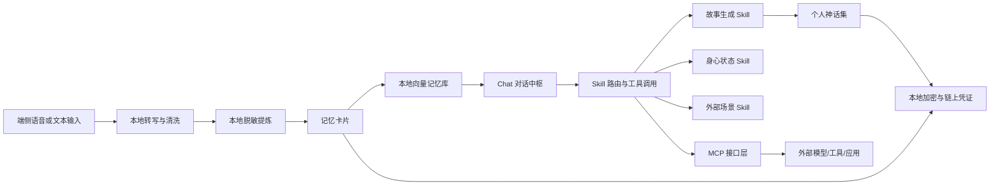
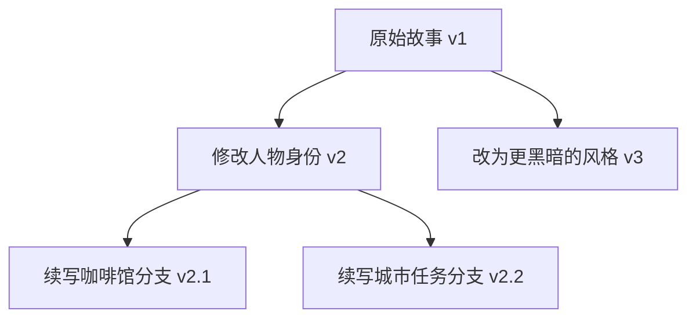
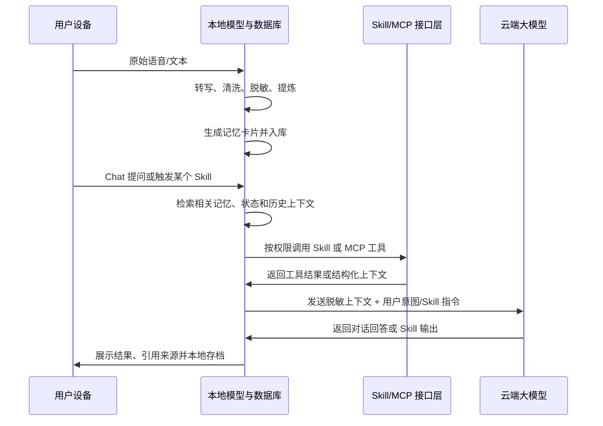

# 智慧分身：隐私优先的个人记忆与对话系统

> 将真实生活中的微小片段，提炼成可检索、可对话、可调用的个人记忆仓库，并通过 Skill 与 MCP 接口扩展到不同生活场景。

<p align="left">
  
  
  
  
</p>

---

## 🚀 快速开始（5 分钟跑通）

### 环境要求
- Python 3.10+
- （可选）DeepSeek API Key — 不配置也能以 `dry_run` 模式完整体验框架

### 1. 克隆并安装

```bash
git clone https://github.com/zhongxiaomi06-sudo/smart-clone-0g.git
cd smart-clone

python -m venv .venv
source .venv/bin/activate        # Windows: .venv\Scripts\activate
pip install -e .[dev]
```

### 2. 启动服务

```bash
# 方式 A:零配置 dry-run 体验(推荐首次体验)
SMART_AVATAR_CONFIG=config/app.dryrun.json python -m uvicorn smart_avatar.app:app --host 0.0.0.0 --port 8000

# 方式 B:接入真实大模型(完整智能体验)
export DEEPSEEK_API_KEY=sk-your-key
python -m uvicorn smart_avatar.app:app --host 0.0.0.0 --port 8000
```

### 3. 打开 Web 控制台

访问 **http://localhost:8000** ，即可看到「午后工作室 · Life OS」控制台：
Chat 中枢 · 录音采集 · 记忆仓库 · 今日故事 · Skill Registry · MCP 工具 · 授权凭证 · 设置 · 审计日志。

API 交互文档见 **http://localhost:8000/docs** （Swagger UI，自动生成）。

### 4. 运行测试

```bash
python -m pytest tests/ -q        # 22 个用例,覆盖框架/API/商业化
```

---

## 🐳 一键部署

### Docker（本地 / 任意 VPS）

```bash
docker build -t smart-clone .
docker run -d -p 8000:8000 \
  -e DEEPSEEK_API_KEY=sk-your-key \
  -v $(pwd)/data:/app/data \
  --name smart-clone smart-clone
# 访问 http://localhost:8000
```

### Render.com（免费云托管,从 GitHub 自动部署）

仓库已内置 `render.yaml`，在 [Render Dashboard](https://dashboard.render.com) → **New +** → **Blueprint** → 连接本仓库即可一键部署。
详见 [docs/DEPLOY.md](docs/DEPLOY.md)。

---

## 🔌 技术接入方式

| 接入层 | 说明 | 入口 |
| --- | --- | --- |
| **REST API** | 记忆/状态/对话/Skill/凭证全量接口 | `/api/v1/*`，文档见 `/docs` |
| **Web App** | 午后工作室控制台，覆盖全部功能 | `/` |
| **Skill 插件** | 新增 `skills/<name>/skill.json` 即插即用，核心代码零改动 | `skills/` |
| **MCP 工具** | 通过 `tools/<name>/tool.json` 声明外部工具，统一网关调用 | `tools/` |
| **模型 Provider** | 抽象适配任意 OpenAI 兼容服务（DeepSeek/通义/Moonshot/Ollama） | `config/app.json` |

**示例：发起一次对话**

```bash
curl -X POST http://localhost:8000/api/v1/chat \
  -H "Content-Type: application/json" \
  -d '{"message":"帮我复盘最近让我消耗的事情"}'
```

**示例：新增一个 Skill**（无需改核心代码）

```bash
mkdir -p skills/my_skill
# 编写 skills/my_skill/skill.json(manifest)+ prompt.md(提示词)
# 重启后 Chat 即可通过触发词自动路由
```

---

## ⛓️ 0G Compute Network 集成（赛道2）

本项目已接入 **0G Compute Network(Galileo 测试网，Chain ID 16602)**,通过 python-0g SDK 直连链上 Provider，使用 TEE 可验证推理，响应携带链上 chatID。

### 链上证据（实时可验证，非 mock）

以下操作均为 Galileo 测试网上的真实交易，可在浏览器实时查验:

- **用户账户**:[0x1a6A20590D06B872110fE220198A3B76dE65B244](https://chainscan-galileo.0g.ai/address/0x1a6A20590D06B872110fE220198A3B76dE65B244)
- **创建推理账本**(addLedger，预存 0.3 0G)：见账户页首笔合约交互
- **锁仓给 TEE Provider**(transferFund 0.2 0G → qwen2.5-omni-7b):[`0x02ce03a2…7743ed6`](https://chainscan-galileo.0g.ai/tx/0x02ce03a2b0671dc48eddae2b217e4eb7db32a01b12b04f0ad834fe0687743ed6)
- **确认 TEE 签名者**(acknowledgeTEESigner):[`0xe6d81647…b320d50c`](https://chainscan-galileo.0g.ai/tx/0xe6d816472e64af7c998682e7936604ad254881f0170ee3e8280dfd73b320d50c)

### 0G 提供什么

- **去中心化 AI 算力**：模型调用上链存证、可信追溯
- **TEE 可验证推理**：链上 chatID + TEE 签名者确认，可验证响应完整性与来源
- **Galileo 测试网可用服务**:`qwen/qwen2.5-omni-7b`、`openai/gpt-oss-20b`、`google/gemma-3-27b-it` 等(均为 TeeML 可验证）
- **价格优势**：较官方 API 最高直降 80%

### 两种接入方式

| 方式 | 适用场景 | 可验证推理 | 配置 |
| --- | --- | --- | --- |
| **Router API** | 快速接入、Serverless | ❌（走网关） | `ZG_ROUTER_API_KEY` |
| **SDK 直连** | 完整特性、Hackathon 加分 | ✅（TEE + chatID） | `A0G_PRIVATE_KEY` + `A0G_RPC_URL` |

### 快速接入（Router API）

1. 打开 [pc.0g.ai](https://pc.0g.ai)，连接钱包并充值 0G token
2. 创建 API Key
3. 配置环境变量：

```bash
export ZG_ROUTER_API_KEY=your-router-api-key
export SMART_AVATAR_CONFIG=config/app.0g.json
python -m uvicorn smart_avatar.app:app --host 0.0.0.0 --port 8000
```

### 完整接入（SDK 直连，支持可验证推理）

1. 安装 0G SDK：

```bash
pip install -e .[zg]
```

2. 配置 EVM 私钥与 RPC：

```bash
export A0G_PRIVATE_KEY=your-evm-private-key  # 无 0x 前缀
export A0G_RPC_URL=https://evmrpc-testnet.0g.ai
export SMART_AVATAR_CONFIG=config/app.0g.json
python -m uvicorn smart_avatar.app:app --host 0.0.0.0 --port 8000
```

3. `config/app.0g.json` 中 `model.provider` 已为 `0g_verifiable`,TEE 可验证推理默认启用。
4. 首次使用需完成链上开户（创建账本、锁仓、确认 TEE 签名者），一条命令自动完成：

```bash
A0G_PRIVATE_KEY=<私钥> python scripts/zg_add_account.py
```

### 可验证推理如何体现

每次通过 0G SDK 发起的对话，响应中都会携带：

```json
{
  "verification": {
    "network": "0G Compute Network",
    "model": "qwen/qwen2.5-omni-7b",
    "provider": "0xa48f...7836",
    "chat_id": "0x...",
    "verifiable": true
  }
}
```

- `chat_id`：链上推理凭证，可用于验证响应未被篡改
- `provider`：实际提供算力的 TEE 节点地址
- `model`：本次调用的模型（默认优先 qwen2.5-omni-7b，可通过 `zg_prefer_model` 配置）

### 多模型协作

系统支持同时配置多个模型 Provider，Chat 中枢可根据意图路由到不同模型：

- **0G Compute**：日常对话、故事生成、复盘分析（可验证推理）
- **Gonka Router / DeepSeek / OpenAI**：备用推理、开发调试

---

## 1. 产品定位

智慧分身是一个面向个人的数字记忆与对话 Demo。它不以“替你做决定”为核心，而是帮助你记录、回忆、反思，并通过可插拔 Skill 调用自己的记忆仓库，完成不同场景下的自我管理与创作。

系统围绕五个关键词展开：

- **隐私**：原始语音、原始文本和完整生活轨迹默认只保留在本地。
- **记忆**：把一天中有价值的事件、情绪、洞察提炼为结构化记忆卡片。
- **对话**：以 Chat 作为主入口，让用户用自然语言查询、整理和调用自己的记忆。
- **接口**：通过 Skill、MCP 和外部工具接口，把记忆能力扩展到不同垂直场景。
- **可信**：通过本地加密、链上凭证和可验证授权，减少平台方对用户私密数据的控制。

一句话概括：

> 这是一个本地保存真实记忆、以对话为主入口、通过 Skill 与 MCP 扩展能力边界的个人数字分身系统。

## 2. 核心用户价值

| 价值 | 用户获得什么 |
| --- | --- |
| 回忆增强 | 从长期记忆中找回被遗忘的具体时刻、情绪和想法 |
| 自我觉察 | 看见自己的行为模式、情绪趋势、性格侧面和价值变化 |
| 对话入口 | 用 Chat 查询记忆、调用工具、触发不同场景 Skill |
| 可选创作 | 在需要时调用故事生成 Skill，把真实记忆转化为个人叙事 |
| 隐私保护 | 原始数据不上传，云端只接收脱敏后的结构化片段 |
| 身心联动 | 将主观记忆与睡眠、心率、运动等身体信号进行低风险关联 |
| 数据主权 | 通过本地密钥、授权记录和链上哈希证明，让用户掌握数据使用权 |
| 外部拓展 | 通过 MCP 和插件接口接入日程、健康、创作、复盘等垂直应用 |
| 生活诗化 | 让普通的一天拥有被重新叙述、收藏和续写的意义 |

## 3. 设计原则

1. **Chat-first**：基础入口是对话，故事、报告、健康分析等能力都作为可调用 Skill。
2. **本地优先**：能在端侧完成的处理，优先放在端侧完成。
3. **最小上传**：云端只接收完成脱敏、摘要和结构化后的记忆卡片。
4. **记忆仓库中心化**：底层只建设稳定的记忆仓库、检索、权限和接口，不把单一应用写死进架构。
5. **Skill 可插拔**：不同垂直场景通过 Skill 接入，按需调用记忆、状态、模型和外部工具。
6. **用户主权**：用户可以查看、删除、编辑、导出自己的记忆、状态、授权和生成内容。
7. **边界清晰**：界面明确区分真实记忆、模型推断、工具结果和文学虚构。
8. **传感器克制**：身体与环境数据只用于趋势观察和自我觉察，不做医疗诊断。
9. **链上最小化**：链上只存证明、授权和审计信息，不存原始记忆、身体数据或故事全文。
10. **渐进落地**：Demo 阶段先验证“记忆仓库 + Chat + Skill 接口”的基础闭环，再扩展垂直应用、智能硬件和 Web3 信任层。

## 4. 系统总览



系统由八个核心模块构成：

| 模块 | 作用 | 默认运行位置 |
| --- | --- | --- |
| 端侧采集与提炼 | 将语音或文本转为脱敏记忆卡片 | 本地 |
| 个人向量记忆库 | 保存、检索、摘要和管理长期记忆 | 本地 |
| Chat 对话中枢 | 作为主入口理解用户意图、检索记忆、调用 Skill | 本地检索 + 云端推理 |
| Skill 接口层 | 将故事、复盘、健康、日程等能力做成可插拔接口 | 本地编排 + 可选云端 |
| MCP 接口层 | 连接外部工具、模型、数据源和第三方应用 | 本地/服务端 |
| 故事生成 Skill | 在用户主动调用时，把记忆改写为魔幻现实故事 | 云端 + 本地存档 |
| 自我觉察报告 | 生成情绪、性格、价值观变化视图 | 本地聚合 + 可选云端总结 |
| Web3 隐私信任层 | 保存哈希证明、授权记录和可验证凭证 | 本地钱包 + 链上 |

## 5. 功能模块

### 5.1 端侧语音采集与脱敏提炼

这是系统的隐私屏障，也是所有记忆素材的入口。

**目标**

- 将用户一天中的语音、手动记录或导入文本转为可用的结构化记忆。
- 在本地完成原始数据处理，尽量避免敏感内容进入云端。
- 将无效寒暄、隐私细节和噪声过滤掉，只保留对回忆与叙事有价值的信息。

**能力**

- 本地语音转写：使用量化 Whisper 小模型或系统级语音识别，将短时录音转为文本。
- 滑窗内容提炼：使用本地小语言模型对长文本分段处理，抽取事件、情绪、洞察和性格侧面。
- 实体脱敏替换：将真实人名、地名、公司名和精确数字替换为代号。
- 自动删除策略：原始音频和原始文本可设置保留周期，默认短期自动清理。

**记忆卡片示例**

```json
{
  "id": "memory_2026_07_06_001",
  "time_range": "上午",
  "event_summary": "用户在一次讨论中坚持了自己的判断，并尝试用更温和的方式解释原因。",
  "emotion": {
    "label": "紧张但坚定",
    "intensity": 0.72
  },
  "insight": "用户在面对不同意见时，更在意观点是否被充分理解，而不只是赢得讨论。",
  "personality_signals": ["执着", "解释欲", "责任感"],
  "entities": {
    "people": ["同事A"],
    "places": ["工作场景A"]
  },
  "privacy_level": "desensitized",
  "source_type": "local_transcript"
}
```

### 5.2 个人向量记忆库

这是数字分身的长期记忆系统。

**目标**

- 支持按时间、情绪、人物代号、主题和语义相似度检索过往记忆。
- 让用户可以用自然语言询问自己的经历，而不是手动翻日志。
- 控制记忆膨胀，长期保持可用、可解释、可删除。

**能力**

- 向量编码：使用本地嵌入模型将事件和洞察字段转为向量。
- 本地存储：使用向量数据库或轻量本地数据库保存记忆卡片与索引。
- 多维检索：支持语义检索、时间过滤、情绪过滤、标签过滤。
- 生命周期管理：支持手动删除、自动降权、周期摘要合并和导出备份。

### 5.3 Chat 对话中枢

这是系统的主入口。用户不需要先选择“故事”“报告”或“健康分析”，而是直接通过 Chat 表达意图，再由对话中枢决定是检索记忆、生成回答，还是调用某个 Skill。

**典型问题**

- “我最近是不是太固执了？”
- “上次让我真正放松是什么时候？”
- “最近哪些事情让我反复感到消耗？”
- “我在哪些场景里最容易表现出创造力？”

**处理流程**

1. 用户提出问题。
2. Chat 中枢判断意图：回忆、反思、创作、统计、健康关联或外部工具调用。
3. 本地向量库检索相关记忆卡片，必要时检索状态卡片和历史生成内容。
4. 本地侧组装脱敏上下文，并检查权限与上传边界。
5. 对话中枢直接回答，或路由到对应 Skill/MCP 工具。
6. 返回结果时标注引用了哪些记忆卡片、状态卡片或工具输出。

**回答原则**

- 不虚构不存在的记忆。
- 区分事实、推断和建议。
- 允许用户追问“为什么这样判断”。
- 对高风险主题保持克制，不替代医疗、法律或财务建议。

### 5.4 Skill 与 MCP 接口层

Skill 层是系统向外拓展的关键。底层不把某一种应用写死，而是提供稳定的记忆检索、权限控制、上下文组装和工具调用能力，让不同场景可以像插件一样接入。

**Skill 的定位**

- Skill 是对记忆仓库的一种使用方式，而不是底层架构本身。
- 每个 Skill 都声明自己需要读取哪些记忆、状态、历史版本或外部工具。
- Chat 中枢根据用户意图调用 Skill，也允许用户手动指定 Skill。
- Skill 输出必须标注使用了哪些记忆来源，以及哪些内容属于模型推断。

**可拓展 Skill 类型**

| Skill | 调用什么 | 解决什么问题 |
| --- | --- | --- |
| 故事生成 Skill | 当日记忆卡片、性格侧面、用户设定 | 把记忆转化为文学叙事 |
| 周复盘 Skill | 一周记忆、情绪标签、目标记录 | 总结状态、发现模式 |
| 身心状态 Skill | 状态卡片、睡眠、运动、环境数据 | 观察身体与心理关联 |
| 日程建议 Skill | 记忆、状态、日历、任务工具 | 安排低消耗的行动计划 |
| 关系洞察 Skill | 脱敏人物代号、互动记忆 | 分析沟通模式 |
| 创作素材 Skill | 记忆片段、故事库、灵感标签 | 生成文章、脚本、播客素材 |

**MCP 接口层**

MCP 可以作为外部能力接入协议，让系统调用更多工具和数据源：

- 读取日历、待办、笔记、文件和本地数据库。
- 调用不同模型服务、绘图工具、语音工具或自动化工具。
- 把用户自定义 Skill 以标准接口接入 Chat 中枢。
- 统一管理工具权限、输入输出和调用日志。

Demo 阶段可以先做一个轻量 Skill Registry，每个 Skill 用一个配置文件描述名称、用途、输入、输出、权限和调用方式。后续再把它升级为正式 MCP 工具接口。

**基础接口建议**

| 接口 | 作用 | 最小输入 | 最小输出 |
| --- | --- | --- | --- |
| MemoryQuery | 从记忆仓库检索卡片 | query、time_range、tags、limit | memory_cards、citations |
| StateQuery | 查询身体与环境状态 | date_range、signal_types | state_cards、trend_summary |
| SkillRun | 运行某个 Skill | skill_name、user_intent、context_refs | skill_result、used_context |
| ToolCall | 调用 MCP 工具 | tool_name、arguments、permission_token | tool_result、audit_id |
| PermissionGrant | 授权 Skill 或工具访问数据 | target、scope、expires_at | permission_token、policy |
| PermissionRevoke | 撤销授权 | permission_id、reason | revoked_at、audit_id |
| AuditLog | 查看调用与授权记录 | date_range、target_type | audit_events |

**Skill 配置示例**

```json
{
  "name": "daily_story",
  "display_name": "每日故事生成",
  "type": "skill",
  "description": "基于用户主动选择的记忆卡片生成魔幻现实故事。",
  "entry": {
    "kind": "internal",
    "handler": "skills.daily_story.run"
  },
  "memory_scope": {
    "default_time_range": "today",
    "allowed_fields": ["event_summary", "emotion", "insight", "personality_signals"],
    "requires_user_confirm": true
  },
  "permissions": ["memory:read:desensitized", "story:write"],
  "output_schema": ["title", "story", "real_anchors", "fictional_elements", "continuation_hook"]
}
```

### 5.5 故事生成 Skill（可插拔能力）

故事生成是系统内置的一个示范 Skill，不是系统的唯一主入口。它通过 Chat 或定时规则调用记忆仓库，把真实生活片段转化为可收藏、可续写的个人叙事。

**目标**

在用户主动调用、定时触发或场景规则触发时，从记忆仓库中提取若干个高价值片段，生成一篇既忠于事实又具有想象力的个人故事。

**Skill 调用流程**

1. 当天记忆卡片聚合。
2. 根据情绪强度、戏剧性、启发性和新鲜度筛选素材。
3. 分析当天最突出的性格侧面。
4. 将性格侧面放大为魔幻设定或象征母题。
5. 生成故事正文、真实锚点列表和虚构元素列表。
6. 归档到个人神话集。

**故事规则**

- 主角使用用户设定的化名。
- 地点和事件细节必须来自当天记忆卡片。
- 风格偏向魔幻现实主义、都市奇幻或轻文学。
- 真实事件是“锚点”，超自然设定是“羽翼”。
- 结尾保留一个选择、秘密或未完成的行动，方便用户续写。
- 输出必须说明调用了哪些记忆卡片，哪些元素来自文学虚构。

**输出结构**

```markdown
# 2026-07-06：能读懂云层皱褶的人

## 故事
...

## 今日真实锚点
- 上午的一次讨论
- 午后短暂的独处
- 傍晚对某个问题的重新理解

## 文学虚构元素
- 主角能从云层纹理中读取时间留下的暗号
- 城市中存在一条只在黄昏显影的道路

## 今日性格侧面
观察力、执着、对意义的敏感

## 续写钩子
主角必须决定是否打开那封没有署名的信。
```

### 5.6 共同创作 Skill

共同创作也可以作为故事生成 Skill 的子能力。用户不是故事的被动接收者，而是合著者。

**能力**

- 任意修改：人物、对话、设定、风格、结尾都可以改。
- 指令续写：用户可以指定下一步剧情方向。
- 分支保存：每次修改形成一个版本节点。
- 回溯比较：支持查看不同版本之间的变化。
- 边界标识：用标签区分真实记忆、模型推断和文学虚构。

**版本模型**



### 5.7 自我觉察与长期报告

这是系统的长期价值。

**能力**

- 情绪图谱：统计高频情绪、触发场景和变化趋势。
- 性格侧面曲线：观察“执着、回避、创造力、敏感度”等特质的阶段性变化。
- 价值观演变：从长期记忆中总结用户反复在意的东西。
- 故事主题谱系：分析个人神话集中反复出现的意象、选择和冲突。

**注意**

这些报告应被设计为“帮助用户观察自己”的工具，而不是对用户进行固定标签化判断。

## 6. 数据流与隐私边界



**默认不上传**

- 原始音频
- 原始转写全文
- 精确定位
- 通讯录、真实人名、公司名
- 未脱敏的完整对话
- 未加密的记忆卡片、身体状态数据和故事全文
- 任何可反推出身份、地点、健康状态的链上明文数据

**允许上传**

- 脱敏后的记忆卡片
- 用户主动输入的问题
- 共同创作时用户主动提供的设定
- 必要的故事上下文和版本上下文
- 经用户授权后的 Skill 输入参数和 MCP 工具结果摘要

**允许上链**

- 本地数据的哈希指纹，用于证明某条记忆或故事在某个时间点已经存在。
- 用户授权、撤销授权和数据使用范围的记录。
- 模型生成结果的版本证明，例如故事版本哈希、提示词版本哈希。
- 零知识证明或可验证凭证的结果，不公开原始内容。

**隐私红线**

- 用户必须能一键暂停采集。
- 用户必须能查看每次发送到云端的内容。
- 用户必须能查看每次写入链上的字段。
- 用户必须能删除任意记忆卡片和故事版本。
- 涉及他人语音时，需要明确提示录音合规和同意风险。
- 链上数据不可篡改，也很难真正删除，因此绝不能把隐私明文写入链上。
- 外部 Skill 和 MCP 工具不能绕过 Chat 中枢直接读取完整记忆库。

## 7. 未来拓展：智能硬件与身心状态感知

当“记忆卡片 + 故事生成”的核心闭环被验证后，系统可以进一步接入米家、小米手表/手环以及其他可穿戴设备和智能家居设备。这个阶段的目标不是把产品变成健康医疗工具，而是让数字分身更理解用户当天的身体状态、环境压力和心理波动。

### 7.1 升级定位

未来版本可以从“生活记忆系统”升级为“身心状态叙事系统”。

它不只回答：

> 今天发生了什么？

还可以进一步回答：

> 今天的身体状态、环境变化和心理感受之间，可能有什么关联？

### 7.2 可接入数据

具体接入能力需要以用户授权、设备支持和官方开放能力为准。Demo 设计上可以先抽象为统一的“状态数据输入层”。

| 数据来源 | 可能数据 | 用途 |
| --- | --- | --- |
| 手表/手环 | 心率、睡眠、运动、步数、久坐提醒、压力趋势 | 判断疲劳、恢复、紧张、活跃度 |
| 手机系统 | 屏幕使用、日程、位置类型、专注模式 | 辅助理解作息节奏和场景切换 |
| 米家设备 | 温湿度、空气质量、光照、噪音、智能场景触发 | 关联环境变化与情绪/睡眠 |
| 用户自评 | 心情、精力、压力、身体不适、专注度 | 校准模型对状态的解释 |

### 7.3 状态卡片

在原有“记忆卡片”之外，未来可以增加“状态卡片”。记忆卡片记录事件，状态卡片记录身体与环境趋势。

```json
{
  "id": "state_2026_07_06",
  "date": "2026-07-06",
  "sleep_summary": "睡眠时长偏短，夜间有多次醒来迹象。",
  "body_signals": ["下午心率较平时偏高", "运动量低于近七日平均"],
  "environment_signals": ["夜间室内温度偏高", "午后空气质量下降"],
  "self_report": {
    "energy": "偏低",
    "mood": "容易烦躁",
    "stress": "中等偏高"
  },
  "possible_links": [
    "睡眠不足可能放大了下午讨论时的紧张感",
    "运动量偏低可能影响了晚间恢复感"
  ],
  "risk_level": "observation_only"
}
```

### 7.4 身心融合分析

未来的回忆式对话可以同时检索两类信息：

- **记忆卡片**：今天发生了什么，用户如何理解这些事件。
- **状态卡片**：身体与环境处于什么趋势，是否存在可观察的关联。

典型问题会从单纯回忆升级为身心关联分析：

- “我最近为什么总觉得容易烦？”
- “哪几天我的创作状态最好？那几天睡眠和运动有什么共同点？”
- “我什么时候最容易在沟通中失去耐心？”
- “我的低落更像是事件触发，还是作息和身体恢复不足造成的？”

回答时必须保持克制：

- 可以说“这些数据提示一种可能关联”。
- 不应说“你患有某种问题”。
- 不应给出医疗诊断或治疗方案。
- 必须鼓励用户在持续异常或明显不适时咨询专业人士。

### 7.5 对故事生成 Skill 的升级

智能硬件数据可以在用户授权后，成为故事生成 Skill 的“身体天气”。

原本的每日故事主要来自事件：

> 用户在会议中坚持表达观点，午后独处，傍晚重新理解了某个问题。

升级后可以加入状态层：

> 用户昨夜睡眠破碎，午后心率偏高，傍晚在低能量状态下仍完成了一次自我整理。

这会让故事更有生命感。比如：

- 睡眠不足可以被转化为“梦境裂缝没有完全合上”。
- 心率波动可以被转化为“城市在胸腔里敲响暗号”。
- 运动恢复可以被转化为“身体重新找回通往现实的道路”。
- 室内光照和温度变化可以成为故事里的季节、天气和场景隐喻。

### 7.6 交互升级

未来界面可以增加三个视图：

| 视图 | 作用 |
| --- | --- |
| 身体天气 | 用低医疗化语言展示睡眠、精力、压力、恢复趋势 |
| 状态关联 | 观察事件、情绪、睡眠、运动、环境之间的弱关联 |
| 修复建议 | 给出休息、呼吸、散步、减少刺激等低风险建议 |

这里的建议应该以“轻提醒”为主，而不是强干预。例如：

- “今天适合降低社交密度。”
- “可以安排一次 10 分钟无屏幕休息。”
- “今晚的故事显示你处在高消耗状态，适合早点结束输入。”

### 7.7 隐私与安全边界

身体数据比普通记忆更敏感，因此需要更严格的默认策略：

- 身体原始数据默认只保存在本地。
- 云端只接收聚合后的状态描述，不上传逐分钟心率、睡眠曲线等原始序列。
- 用户可以关闭任意数据源，例如只启用睡眠，不启用运动或环境。
- 所有状态分析都必须标注“观察性推断”，避免医疗化表达。
- 故事生成可以使用身体状态隐喻，但不能暴露具体健康数值。

## 8. 未来拓展：Web3 与链上隐私保护

Web3 的作用不是把用户记忆、身体数据或故事直接放到链上。相反，它应该作为一个“可信控制层”，让用户能够证明数据存在、管理授权、追踪访问记录，并在不暴露内容的情况下完成必要验证。

核心原则：

> 原始数据不上链，隐私内容不上链，链上只放不可逆证明和授权状态。

### 8.1 为什么引入 Web3

当前系统主要依靠本地存储和云端不保留数据来保护隐私。未来如果出现多设备同步、第三方应用调用、模型服务商接入、故事作品确权等场景，就需要更强的数据主权机制。

Web3 可以解决的不是“替代本地隐私”，而是这些问题：

- **存在证明**：证明某条记忆、状态卡片或故事版本在某个时间点已经存在，但不公开内容。
- **授权管理**：用户可以授权某个模型、应用或设备在特定范围内使用数据。
- **撤销与审计**：授权、撤销和访问请求可以留下可验证记录。
- **作品确权**：用户可以为主动公开的故事版本生成创作凭证。
- **跨平台迁移**：用户不依赖单个平台账号，也能证明自己拥有某份加密数据。

### 8.2 链上与链下分工

| 数据类型 | 存放位置 | 原因 |
| --- | --- | --- |
| 原始音频、原始文本 | 本地加密存储 | 最高敏感级别，不应离开设备 |
| 记忆卡片、状态卡片 | 本地数据库，必要时端侧加密同步 | 可检索、可删除、可编辑 |
| 故事全文与版本树 | 本地存档，用户选择后可加密备份 | 保护私密叙事和创作过程 |
| 哈希指纹 | 链上 | 证明内容存在且未被篡改 |
| 授权记录 | 链上或本地可验证日志 | 证明用户何时授权了什么范围 |
| 加密备份文件 | 可选去中心化存储或普通云存储 | 只保存密文，不保存明文 |
| 零知识证明结果 | 链上或验证端 | 证明某个条件成立，但不暴露原始数据 |

### 8.3 隐私保护机制

**本地加密金库**

- 用户的记忆卡片、状态卡片和故事版本先在本地加密。
- 加密密钥由用户设备或用户钱包控制。
- 云端和链上都不直接持有明文数据。

**哈希承诺**

- 对某个记忆卡片或故事版本计算哈希。
- 链上只保存哈希，不保存内容。
- 未来用户可以用本地原文重新计算哈希，证明内容没有被修改。

**可撤销授权**

- 用户可以授权某个模型服务读取某类脱敏卡片。
- 授权范围可以包含数据类型、时间范围、用途和过期时间。
- 撤销授权后，后续访问应被拒绝，并在审计记录中体现。

**零知识证明**

在更高级版本中，系统可以证明某个结论成立，而不暴露原始数据。例如：

- 证明用户连续 7 天完成记录，但不公开每天记录内容。
- 证明某篇故事来自当天记忆卡片，但不公开卡片正文。
- 证明某个状态趋势来自授权设备数据，但不公开具体心率或睡眠曲线。

### 8.4 典型使用场景

| 场景 | 链上提供什么 | 不上链什么 |
| --- | --- | --- |
| 记忆防篡改 | 记忆卡片哈希、生成时间证明 | 卡片正文、原始语音 |
| 故事确权 | 故事版本哈希、作者钱包签名 | 私密故事全文 |
| 第三方模型调用 | 授权范围、过期时间、撤销状态 | 用户完整记忆库 |
| 身体数据证明 | 聚合状态证明、设备数据来源证明 | 心率曲线、睡眠明细 |
| 跨设备迁移 | 加密备份索引、所有权证明 | 解密密钥、明文数据 |

### 8.5 用户交互设计

Web3 能力不能变成用户负担。界面上应尽量使用人能理解的语言：

- “生成本地加密备份”
- “为今天的故事生成不可篡改证明”
- “授权该模型读取最近 7 天的脱敏记忆”
- “撤销所有第三方访问”
- “查看链上授权记录”

钱包、签名、Gas、合约等术语应放在高级设置里，默认体验应该像普通隐私开关。

### 8.6 不建议做的事

- 不把原始记忆、身体数据、心理分析、故事全文直接铸造成公开 NFT。
- 不把用户每日情绪、健康状态或行为标签写成链上明文。
- 不用钱包地址直接绑定真实身份、手机号或社交账号。
- 不让链上记录暴露用户每天的固定行为节奏。
- 不用“去中心化”替代真正的数据最小化和本地加密。

### 8.7 Demo 阶段可做的最小 Web3 能力

Demo 阶段可以先不接真实主网，而是做一个“链上凭证模拟层”：

- 为每张记忆卡片生成本地哈希。
- 为每日故事生成版本哈希。
- 保存授权记录和撤销记录。
- 在界面展示“本次云端调用使用了哪些卡片”。
- 后续再把哈希和授权记录接入测试网或正式链。

这样既能验证产品逻辑，又不会过早引入链上成本、合约安全和用户钱包门槛。

## 9. 技术架构建议

| 层级 | 任务 | Demo 推荐方案 | 后续可替换方案 |
| --- | --- | --- | --- |
| 输入层 | 文本/语音输入 | 手动文本 + 短时录音 | 全天候端侧采集 |
| 传感层 | 身体与环境数据 | 手动导入/模拟状态数据 | 米家、小米手表/手环、系统健康数据 |
| 转写层 | 语音转文本 | Whisper.cpp / 系统语音识别 | 更强本地 ASR 模型 |
| 提炼层 | 脱敏与结构化 | 本地小模型或规则 + 云端辅助 | Phi 系列、Qwen 小模型等 |
| 状态层 | 身心状态聚合 | 日级状态卡片 | 分时段趋势、跨设备状态融合 |
| 记忆层 | 存储与检索 | SQLite + 向量扩展 / ChromaDB | LanceDB、Milvus Lite |
| 加密层 | 本地数据保护 | 本地密钥 + 文件级加密 | 钱包密钥、硬件安全区、多设备密钥同步 |
| 信任层 | 授权与证明 | 本地哈希凭证模拟 | 链上哈希、DID、可验证凭证、零知识证明 |
| 对话层 | 主入口与意图理解 | Chat 中枢 + 本地检索 | 多模型路由、长上下文对话状态 |
| Skill 层 | 垂直场景能力 | 内置故事 Skill + Skill Registry | 用户自定义 Skill、场景应用市场 |
| MCP 层 | 外部工具接口 | 本地工具适配器 | 标准 MCP Server、第三方工具生态 |
| 嵌入层 | 文本向量化 | bge-small-zh 类本地模型 | 多语言嵌入模型 |
| 推理层 | 回忆与反思 | 可配置云端大模型 | 本地大模型 + 云端混合 |
| 创作层 | 可选叙事 Skill | 云端大模型 + 作家提示词 | 多风格模型路由、用户自定义叙事模板 |
| 界面层 | 用户交互 | Web / 桌面端 Demo | 手机端常驻应用 + 智能硬件状态面板 + 授权管理面板 |

## 10. Demo 阶段最优闭环

为了最快验证产品价值，Demo 不建议一开始就做 24 小时录音或复杂硬件接入。更稳妥的路径是先跑通“手动输入或短时录音 -> 记忆卡片 -> Chat 检索对话 -> 调用示范 Skill”的闭环。

### MVP 目标

- 用户可以录入当天 3 到 10 条生活片段。
- 系统自动生成脱敏记忆卡片。
- 用户可以基于记忆提问。
- Chat 中枢可以根据意图检索记忆、回答问题或调用 Skill。
- 系统内置一个故事生成 Skill 作为示范应用。
- 用户可以新增或配置简单 Skill，预留 MCP 工具接口。

### MVP 页面

| 页面 | 核心功能 |
| --- | --- |
| 今日记录 | 输入文本、上传短录音、查看提炼结果 |
| 记忆卡片 | 浏览、编辑、删除、标记真实锚点 |
| 回忆对话 | 基于本地记忆进行问答与反思 |
| Skill 面板 | 查看内置 Skill、配置调用权限、运行示范 Skill |
| 今日故事 | 作为故事 Skill 的结果页，查看真实/虚构边界 |
| MCP 接口 | 管理外部工具、数据源和调用日志 |
| 设置 | 隐私策略、模型配置、数据导出、授权与清除 |

### MVP 成功标准

- 用户愿意连续 7 天记录。
- 回忆对话至少能稳定回答与近期经历相关的问题。
- Chat 能正确判断常见意图，并调用至少一个内置 Skill。
- 故事 Skill 能让用户感到“这确实来自我的一天”。
- 用户能清楚理解哪些数据留在本地、哪些数据被发送到云端。

## 11. 提示词设计方向

### 11.1 记忆卡片提炼提示词

目标是让模型少发挥、多提炼、强脱敏。

```text
你是本地隐私提炼器。你的任务是从用户当天文本中提取高价值生活片段，并输出结构化记忆卡片。

规则：
1. 不得输出真实人名、地名、公司名、账号、电话号码、精确地址或精确金额。
2. 所有实体必须替换为代号，例如“同事A”“朋友B”“常去的咖啡馆”。
3. 忽略无意义寒暄、重复语气词和无法形成记忆价值的内容。
4. 不编造文本中没有出现的信息。
5. 每张卡片只描述一个相对完整的事件或感受。

输出 JSON 数组，字段包括：
id、time_range、event_summary、emotion、insight、personality_signals、entities、privacy_level、source_type。
```

### 11.2 回忆式对话提示词

目标是让模型基于记忆回答，而不是扮演通用人生导师。

```text
你是用户的回忆整理助手。你只能基于提供的脱敏记忆卡片进行回答。

回答要求：
1. 先说明你引用了哪些记忆线索。
2. 区分“记忆事实”“合理推断”“建议”。
3. 如果证据不足，直接说明不足，不要强行下结论。
4. 语气温和、具体、克制。
5. 不提供医疗、法律、财务等高风险结论。
```

### 11.3 Skill 路由提示词

目标是让 Chat 中枢决定是否直接回答，还是调用某个 Skill 或 MCP 工具。

```text
你是智慧分身的对话路由器。你的任务是根据用户输入、可用记忆上下文和已注册 Skill，决定下一步动作。

路由规则：
1. 如果用户只是询问过往经历，优先检索记忆并直接回答。
2. 如果用户要求总结、复盘、创作、计划或状态分析，选择最匹配的 Skill。
3. 如果 Skill 需要外部数据或工具，检查 MCP 工具是否已授权。
4. 不允许任何 Skill 读取超出权限范围的记忆、状态或故事版本。
5. 如果意图不明确，先向用户提出一个简短澄清问题。

输出 JSON：
action、skill_name、required_memory_scope、required_tools、privacy_check、reason。
```

### 11.4 故事生成 Skill 提示词

目标是在真实锚点上进行文学放大。

```text
你是一位魔幻现实主义作家。请基于用户当天的脱敏记忆卡片，生成一篇个人神话故事。

创作规则：
1. 故事主角使用指定化名。
2. 关键事件、地点类型和情绪变化必须来自记忆卡片。
3. 可以加入超自然设定，但必须服务于当天最突出的性格侧面。
4. 不得暴露真实人名、地名、公司名或精确隐私信息。
5. 你只是一个被调用的 Skill，不负责读取完整记忆库，只能使用传入的卡片。
6. 结尾留下一个关于选择、秘密或未完成行动的钩子。

输出包括：
标题、故事正文、今日真实锚点、文学虚构元素、今日性格侧面、续写钩子。
```

## 12. 风险与待决问题

| 风险 | 说明 | 缓解方式 |
| --- | --- | --- |
| 录音合规风险 | 全天候环境录音可能涉及他人隐私 | Demo 先用手动输入和短时录音，并提供明确提示 |
| 过度解读风险 | 模型可能把零散片段解释成固定人格 | 区分事实与推断，避免人格定性 |
| 隐私泄露风险 | 脱敏不彻底可能暴露身份线索 | 本地脱敏校验 + 上传前预览 |
| 身体数据敏感风险 | 睡眠、心率、压力等属于高敏感个人信息 | 默认本地存储、按数据源授权、上传前聚合 |
| 健康误判风险 | 模型可能把普通波动解释成健康问题 | 只做趋势观察，不做诊断和治疗建议 |
| 设备生态依赖风险 | 米家或手表数据接入能力可能随平台变化 | 设计统一数据适配层，允许手动导入和多品牌替换 |
| Skill 越权风险 | 某个 Skill 可能请求超出场景需要的记忆范围 | 每个 Skill 必须声明权限、用途和数据范围 |
| MCP 工具泄露风险 | 外部工具可能记录输入或返回不可控结果 | 工具调用前预览输入，调用后保存审计日志 |
| 链上隐私不可逆风险 | 一旦隐私明文上链，几乎无法真正删除 | 链上只存哈希、授权和证明，不存内容 |
| 钱包与密钥丢失风险 | 用户丢失私钥可能无法恢复加密数据 | 设计本地恢复码、社交恢复或多设备备份 |
| 合约安全风险 | 授权合约漏洞可能造成错误授权或审计失真 | Demo 阶段先做模拟层，正式上链前审计 |
| 情绪依赖风险 | 用户可能过度依赖系统解释自我 | 保持“辅助观察”定位，不制造权威感 |
| 成本风险 | 高质量故事生成依赖云端模型 | 分层模型策略，普通任务本地化 |

**待决问题**

- 记忆卡片是否允许用户手动补充未被采集到的心理活动？
- 每日故事更偏文学收藏，还是偏游戏化连续剧情？
- 用户是否需要多个主角化名，对应不同自我侧面？
- 是否加入“完全离线模式”，牺牲故事质量换取极致隐私？
- 长期报告的周期应以周、月还是主题事件为单位？
- 米家和可穿戴设备接入应优先走官方 API、系统健康数据，还是用户手动导入？
- 状态卡片应该按天生成，还是按早晨、下午、夜晚等时间段生成？
- 身体状态进入故事时，应保持隐喻表达，还是允许用户查看明确关联依据？
- 第一批垂直 Skill 应该优先做周复盘、故事生成、身心状态，还是日程建议？
- MCP 工具调用是否默认只允许读取脱敏摘要，而不允许读取完整卡片？
- Web3 层优先支持本地哈希凭证、测试网记录，还是直接接入正式链？
- 用户密钥恢复应采用助记词、设备密钥、社交恢复，还是多方案并存？
- 个人神话故事是否允许用户主动公开并生成作品凭证？

## 13. 建议路线图

| 阶段 | 目标 | 关键产物 |
| --- | --- | --- |
| Phase 0 | 验证记忆仓库 | 手动输入、脱敏卡片、本地存储 |
| Phase 1 | 验证 Chat 主入口 | 本地向量库、回忆式对话、卡片引用 |
| Phase 2 | 建立 Skill 接口 | Skill Registry、权限声明、故事生成 Skill |
| Phase 3 | 接入 MCP 能力 | MCP 工具适配器、调用日志、输入预览 |
| Phase 4 | 垂直场景扩展 | 周复盘、身心状态、日程建议等场景 Skill |
| Phase 5 | 完善共同创作 | 故事版本树、续写、真实/虚构标注 |
| Phase 6 | 强化端侧隐私 | 本地转写、本地脱敏、上传前审查 |
| Phase 7 | 长期自我觉察 | 情绪图谱、性格趋势、故事主题报告 |
| Phase 8 | 接入智能硬件 | 米家/手表数据适配层、状态卡片、授权管理 |
| Phase 9 | Web3 隐私信任层 | 本地哈希凭证、授权日志、链上证明模拟 |
| Phase 10 | 可验证数据主权 | DID、可验证凭证、零知识证明、跨平台迁移 |

## 14. 项目当前最小定义

当前 Demo 可以先被定义为：

> 一个本地记忆卡片系统，能把用户输入的日常片段转化为可检索记忆，并通过 Chat 主入口调用不同 Skill。

这一定义足够小，可以快速实现；也足够稳定，可以验证“个人记忆仓库 + Chat 对话中枢 + Skill 接口”的基础能力。

未来完整形态可以被定义为：

> 一个融合生活记忆、身体状态、环境信号、Skill/MCP 生态、链上凭证与可选叙事能力的个人数字分身，帮助用户看见自己如何生活、如何感受、如何恢复，并在不暴露隐私的前提下证明、授权和拥有自己的数字记忆。

## 15. 当前代码框架

当前仓库已经按这个方向搭建了应用级底座：

- `src/smart_avatar/app.py`：FastAPI 应用入口。
- `web/`：基础 Web 控制台，覆盖 Chat、记忆、Skill、MCP、授权、凭证和审计。
- `src/smart_avatar/chat.py`：Chat 主入口与 Skill 路由。
- `src/smart_avatar/skills.py`：配置化 Skill Registry。
- `src/smart_avatar/mcp.py`：MCP 工具网关占位层。
- `src/smart_avatar/storage.py`：SQLite 本地记忆与审计存储。
- `src/smart_avatar/privacy.py`：按 Skill 权限投影记忆字段，避免完整卡片外泄。
- `src/smart_avatar/credentials.py`：本地哈希凭证层，为后续链上证明预留接口。
- `src/smart_avatar/models.py`：模型 Provider 抽象，默认 dry-run，不绑定具体模型厂商。
- `skills/daily_story`：故事生成示例 Skill，不写死在核心代码里。
- `skills/weekly_review`：周复盘示例 Skill。
- `tools/example_calendar`：MCP 工具 manifest 示例，默认关闭。

详细运行方式和扩展说明见 `docs/FRAMEWORK.md`。

需求对齐与未完成边界见 `docs/REQUIREMENTS_ALIGNMENT.md`。

商业级部署、安全和上线清单见 `docs/OPERATIONS.md`。
